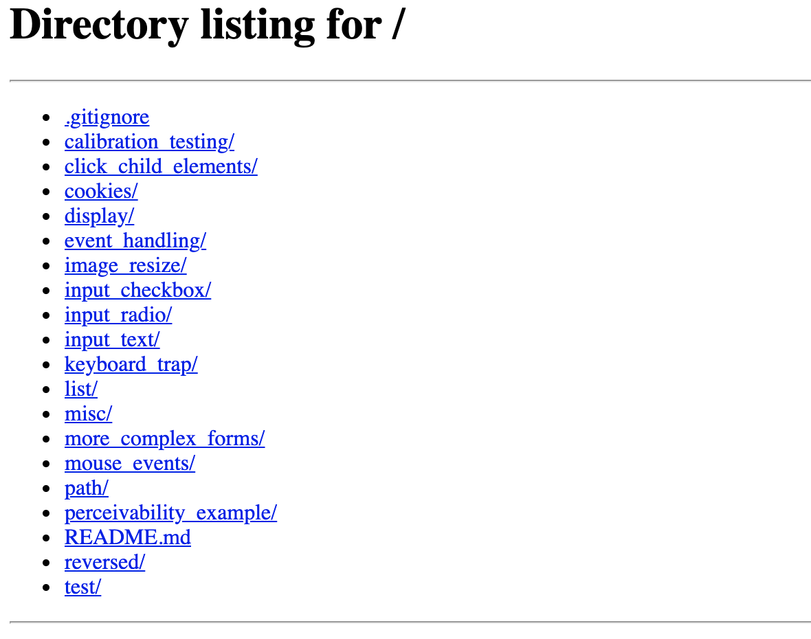
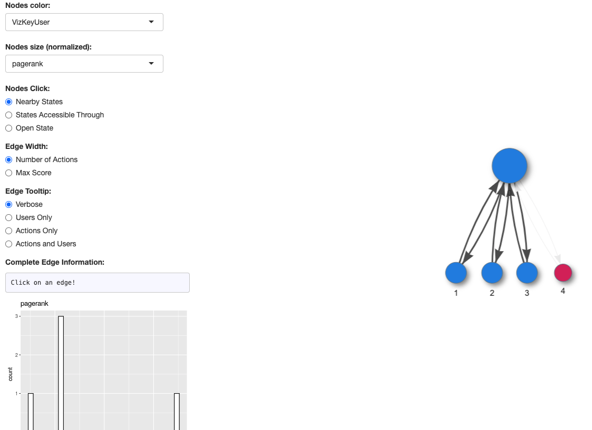
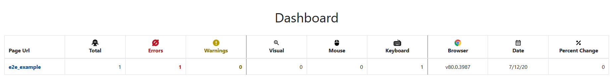

# [Demodocus](https://mitre.github.io/demodocus/)

This framework is intended to extend the capabilities of current automated accessibility testing tools into the realm of dynamic web content. 

In the current workflow, most websites are evaluated for accessibility using:
1. Static tools which check the `html` and `css` of the page to predict inaccessible content
2. Semi-automated tools which can execute pre-configured interactions with the web pages to reach new web page states and then (usually) run a static tool.
3. Human expert testing in which a human user may use the tools above plus other manually driven tools such as a screen reader to check for accessibility violations.

The current problem with these methods is that static tools **do not** check dynamic web content since they don't interact with the page, semi-automated tools are fragile to change and usualy only check the state, not the transition, and human expert testing is expensive and not comprehensive. 

We introduce this software prototype of the Demodocus framework as a solution to the problems posed above. We attempt to ease the burden on human experts by automatically testing the dynamic web content on web pages without apriori information about the page. This means that ideally the tool can be given a page and will automatically identify interactable content, exercise it, and then report back which interactions were inaccessible. 

A common example for this process might be a web page with a dropdown navbar that can only be opened via mouse events. Upon loading the page, Demodocus would identify that the navbar has event handlers attached to it and thus may be interactable. It would then attempt to perform a series of mouse and keyboard actions on the navbar. If it found that mouse actions opened up the navbar, but that no keyboard action achieved the same, then it would report that a violation for the dropdown navbar. 

## Algorithm

The basis for how Demodocus works is quite approachable and can help to get in the mindset for what we are attempting to do.

When Demodocus first arrives at a site, it will first find all elements that it thinks are interactable and will attempt to exercise them. We do this intial crawl with our `Omniuser`, which is modeled as an "omni-potent" user. That is, it can do any and everything with no restriction on the content. At the end of this step, we will have built our `Omni-graph` which will serve as our frame of reference later on. For a simple web page it may look like:


In the graph, you can see the initial state leads to several other states through various edges. In this case, the states are specific instances of content and functionality of the web page and the edges are the interactions between them. Referring back to the dropdown navbar, a closed and an open navbar would be seperate states and the event to open the navbar would be the edge between them. 

We now run a modelled user with a disability over the web page to determine what content it has access to. For example, we might model a user that can only use the keyboard and find that for the same site as above that the user cannot traverse the edges with the `onMouseOver` events. When comparing to the `omni-graph` we see that this looks like the image below, where the blue states with a solid border are reachable for a keyboard user and the red states with a dotted border are inaccessible to the user. 


At this point, we can say that states 3, 5, and 6 are unreachable, and we can point the the `onMouseover` from states 3 and 5 as the reason. Finally, this can be reported back to developers or accessibility experts for further remediation. 

There is a lot of complexity under the hood for implementing this algorithm in the world of web applications along with other checks and features that have been added, but at its core this is still the goal we are trying to achieve. 

## Documentation

Below are some short details on how to get setup and running if you want to test quickly. If you would like more detailed information, please see the [Full Documentation](https://mitre.github.io/demodocus/).

## Setup

See the [setup](./docs/setup.md) page for full details and options to install `demodocusfw`. A typical quick start setup will include:

1. Install the latest stable [Chromdriver](https://chromedriver.chromium.org/) and add it to your PATH. You can test success by running: 
```bash
% chromedriver -v # Outputs chromedriver version
```
2. (Recommended) Setup a python virtual environment using your favorite env manager.
3. Install dependencies. **NOTE**: We currently require python 3.7 or 3.8.
```bash
% pip install -r requirements.txt
```
4. Import the package
```bash
% python setup.py install # Users that want to just use the tool
% python setup.py develop # Users that want to use and develop the tool
```
## Running

After setting up, you should be able to run the crawler with the default configuration by running:

```bash
% python crawler.py http://example.com # Replace with url you wish to evaluate
```

### Configuration Options

For details on all of the different running configuration options available, please see [Configuration Options](./docs/configuration.md)


## End-to-End Example

1. Install [graph-app](./graph-app/README.md) and
   [web-app](./web-app/README.md)

2. Host the `sandbox` (should be available on http://localhost:8080)
   
   ```bash
   % cd demodocusfw/tests/sandbox
   % python -m http.server 8080
   ```
   
   Go to http://localhost:8080 in any web browser and see:
   
   

3. In a new terminal window, run a simple example from the sandbox, like `list/partaccessible_1`.
   This will take about 2-3 minutes to run on most laptops.
   
   ```bash
   % python crawler.py http://localhost:8080/list/partaccessible_1/example.html --output_dir e2e_example/
   ```
   
   The console will have a lot printed to it, but it should start with:
   
   ```
   2020-09-24 08:01:38,121 root:71 INFO MainThread Logging to stdout
   Serving e2e_example on port 50372 in thread Thread-1
   2020-09-24 08:01:38,125 crawler:189 INFO MainThread Crawling http://0.0.0.0:8080/list/partaccessible_1/example.html
   2020-09-24 08:01:39,992 crawler.webaccess:180 INFO MainThread Page load #1
   127.0.0.1 - - [24/Sep/2020 08:01:40] "GET /raw_modified.html HTTP/1.1" 200 -
   2020-09-24 08:01:48,562 crawler.webaccess:189 INFO MainThread http://0.0.0.0:8080/list/partaccessible_1/example.html took 0 seconds to stabilize.
   ...
   ```
   
   and end with :
   
   ```
   ...
   2020-09-24 08:03:38,298 crawler.controller:186 INFO MainThread -- Crawling state 4 --
   2020-09-24 08:03:38,298 crawler.controller:199 INFO MainThread found state 0: click on /html/body/ul/li[4]: 0.9
   2020-09-24 08:03:38,298 crawler:253 INFO MainThread Generating reports for http://0.0.0.0:8080/list/partaccessible_1/example.html
   2020-09-24 08:03:38,301 crawler.graph:234 INFO MainThread Graph successfully saved to: /Users/username/demodocus-framework/e2e_example/full_graph.gml
   /Users/username/anaconda3/envs/py38/lib/python3.8/site-packages/networkx/drawing/layout.py:730: RuntimeWarning: divide by zero encountered in true_divide
     costargs = (np, 1 / (dist_mtx + np.eye(dist_mtx.shape[0]) * 1e-3),
   Stopping server loop
   Stopping server loop
   Stopping server loop
   ```
   
4. You should see a new directory created -- `e2e_example/`. This contains all of the 
   files generated by `demodocus`. You should expect to see all of the following
   files, though the `<user-model>_paths_df.csv` files depend on the configured
   users.
   
   ```
   ├── LowVizMouseKeyUser_paths_df.csv
   ├── SuperVizMouseKeyUser_paths_df.csv
   ├── VizKeyUser_paths_df.csv
   ├── VizMouseKeyUser_paths_df.csv
   ├── analysis_report.md
   ├── analyzed_data.json
   ├── analyzed_full_graph.gml
   ├── crawl.csv
   ├── crawl.log
   ├── crawl_config.txt
   ├── element_map.json
   ├── full_graph.gml
   ├── network_layouts
   │   ├── fr_0.0.png
   │   ├── fr_0.2.png
   | ...
   │   ├── kk_0.0.png
   │   ├── kk_0.2.png
   | ...
   ├── raw.html
   ├── raw_modified.html
   ├── screenshots
   │   ├── state-0.png
   │   ├── state-1.png
   | ...
   └── states
       ├── state-0.html
       ├── state-1.html
       | ...
       ├── state-fields-0.json
       ├── state-fields-1.json
       | ...
       ├── state-template-0.html
       ├── state-template-1.html
       | ...
   ```

5. Open `e2e_example/analyzed_full_graph.gml` in the `graph-app`. Be sure to change
   `/absolute/path/to/e2e_example` to the path on your system. 
   
   ```bash
   % docker run -v /absolute/path/to/e2e_example:/usr/src/crawl_output -p 8081:8081 \
             demodocus-graph-app:latest \
             Rscript --vanilla graph_app.R crawl_output/analyzed_full_graph.gml
   ```
   
   Go to http://0.0.0.0:8081 in any web browser -- your app should look the same
   as what is below. For more information on the functionality, see the
   [demodocus-graph-app README](./graph-app/README.md).
   
   

   
6. Open the results in the `web-app`. Since the web app cannot access local files, we are first going to need to copy them into the app public directory. Copy the **directory** `e2e_example` into `web-app/public/crawls`. Once the files are copied over, you can then run

```bash
% cd web-app && npm run serve
```
to start the web app. Seperate instructions for running with docker can be found in web-app README.

You can the load the page by visiting `http://localhost:8081/`, changing the port number as necessary. When the page first loads, you should see a dashboard that looks like - 



Clicking on the e2e_example link will take you to the inspection pane.


For more information on the web-app please see the README in that directory.

## Contributing

This project has just been open sourced as of 10/16/2020. We are looking for contributors looking to help extend this work. Below are a few suggestions on how to you can start contributing:
1. Find an interesting issues in our list. The list ranges from small bugfixes and code quality improvement to complex additional features!
2. Run the tool on your own web page. What works? What doesn't? If its something you can fix submit an MR, if not submit an issue to document what went wrong. 

## License

Software License Agreement (Apache 2.0)

Copyright (c) 2020, The MITRE Corporation.
All rights reserved.

Licensed under the Apache License, Version 2.0 (the "License");
you may not use this file except in compliance with the License.
You may obtain a copy of the License at

https://www.apache.org/licenses/LICENSE-2.0

Unless required by applicable law or agreed to in writing, software
distributed under the License is distributed on an "AS IS" BASIS,
WITHOUT WARRANTIES OR CONDITIONS OF ANY KIND, either express or implied.
See the License for the specific language governing permissions and
limitations under the License.

If this code is used in a deployment or embedded within another project,
it is requested that you send an email to opensource@mitre.org in order to
let us know where this software is being used.

APPROVED FOR PUBLIC RELEASE. CASE NUMBER: 20-2318
