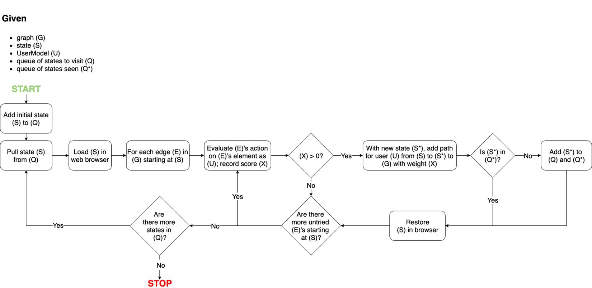

# Crawling

The first step in our process is to build a directed graph of the website. This
is done by creating an `OmniUser`, which should be able to interact with all
elements and access all content. States are created from distinct DOMs and are
crawled in a breadth-first manner. States, represented as nodes in graph, are
connected by an edge for each transition from one state to another where an
action A can be performed on a page element E:

```
(state1) perform some action A on element E –> (state2)
```


When we save score `(X)`, we also capture enough data for user models to decide
if they could also perform this action on the element without having to actually
retry it through the browser.

Two states can be connected by more than one edge if multiple combinations of
actions on elements can be performed to traverse from the first state to the
second.

At this stage, we are building as complete a graph as possible to capture all
possible states and all transitions between states.

Once the graph is created, we instantiate a [UserModel](user-models.md) with a
combination of abilities (like being able to perform keyboard actions, but not
mouse actions). That UserModel then explores the graph to see which edges it can
follow and which states it can reach.



Note that this step is significantly faster because the user model does not
directly interact with the page like the original OmniUser does. Instead, it
filters data captured and decides if an edge from the graph is traversable.
Thus, the overall run-time quickly scales with the number of UserModels.
