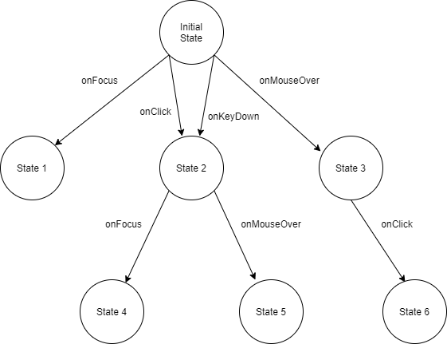
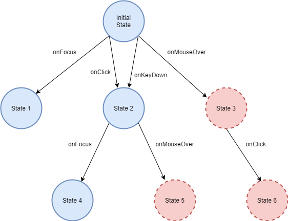

# Overview

The Demodocus Framework enables automated analysis of web site accessibility.
More than just a static page analyzer, Demodocus will simulate real users with
a variety of abilities as they navigate through all potential page states,
including invoking dynamic changes within single pages. Demodocus can then
report on accessibility findings, with a focus on how individual pages will
enable or provide barriers to different users as they navigate the site.

This framework is named after [Demodocus](https://en.wikipedia.org/wiki/Demodocus_(Odyssey_character)),
the blind poet from *The Odyssey*. 

## Technical approach

Demodocus generates a full state graph for a web site, in which a node is a
distinct state of the DOM, JavaScript, and CSS, and an edge is a pair (element,
action) representing some action that can be performed. This initial graph
represent all possible states that fully able users should be able to reach. The
framework then runs simulated users through the graph to determine which states
are accessible by different models of users. These user models can simulate
users with low vision, the ability to navigate the web with only a keyboard, or
other combinations of abilities, including users with a full range of typical
abilities.

From these simulations, the different potential paths and barriers navigable by
different users are recorded and used as the basis of reporting and analysis of
found issues and recommendations to developers for improving site accessibility.

For example, in the image below, all of the states for a page are displayed
with the user actions required to navigate between them.

In the following image, we see that a user browsing with a keyboard cannot
navigate to some page states; the transitions that require a mouse are barriers
to this user, who does not use a mouse.

## Research background

> The web is the prominent way information is exchanged in the 21st century.
However, ensuring web-based information is complicated, particularly with web
applications that rely on JavaScript and other technologies to deliver and build
representations. Static representations are becoming rarer, and assessing
accessibility to ensure access to web-based information is available to all
users is increasingly difficult given the dynamic nature of representations.

Read more in our [literature review paper](https://arxiv.org/pdf/1908.02804.pdf).

## Setup

See [Setup](setup.md) for information on how to get started.

## Usage

See the [End-to-End example](../README.md) for an intended usage of `demodocus`.

## Architecture

See the [Architecture Introduction](introduction.md) for implementaion
information. 