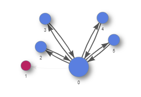
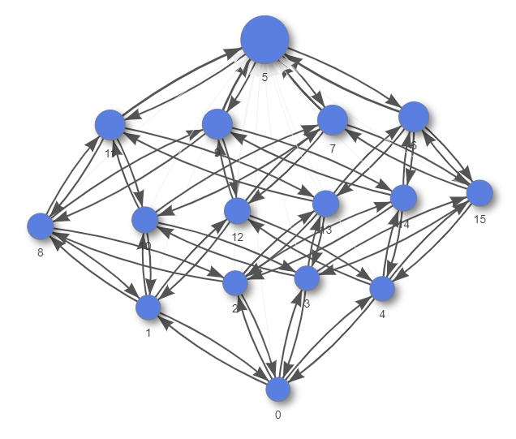

# Running Crawls

## Command-line options

To start the crawler from the command line, serve up your copy of the sandbox
(see [README.md](https://github.com/mitre/demodocus/blob/main/README.md)), and note the port in case you need to change
it), then give `crawler.py` a URL, command, or other "entry point" specific to
your [type of interface](interfaces.md) to start crawling:

```bash
% python crawler.py http://example.com/
```

You can also pass a file with a list of entry points, one per line, to crawl:

```bash
% python crawler.py -i my-list-of-urls.txt
```

Logging options include `-d` or `--debug` for debug-level or `-v` or `--verbose`
for info-level output. Default logging is defined in the configuration module as
`LOG_LEVEL`.

The crawl output directory may be passed as a runtime option using
`--output_dir`. This value is also set by default in the configuration file as
`OUTPUT_DIR`.

## Configuration options

To see the browser in action during crawling, set the configuration variable
`HEADLESS` to `False`. This is `True` by default because seeing multiple
browsers pop up and run autonomously should only happen when you are you sure
you want it to happen.

By default, the crawler will use all available user models. You can specify a
subset with the configuration option `USER_TYPES`.

By default, the crawler will generate a report directory under `builds/crawls`
with timestamp-based name. In that directory will be a crawl log file, a crawl
metrics file, a directory for every crawled entry point with state/edge GML, a
`states` directory containing contents of every state visited from the entry
point, a `screenshots` directory containing PNG screenshots of every state
visited from the entry point, and an accessibility analysis report in Markdown.
The state identifiers should match what is listed in the top-level crawl metrics
file.

The default is to generate all these outputs, but you can specify generating
only some of these reports. For example, to generate only the crawl metrics and
GML files (no DOM, no analysis), use `REPORTS`:

```python
REPORTS = ['metrics', 'gml']
```

To capture a screenshot of every distinct state, which will be stored in a
directory called `screenshots` within the output directory, set
`SCREENSHOTS = True`.

To add a delay when new states are found to make it easier to demonstrate the
work Demodocus is doing, set `DELAY` to a value in seconds. Note: this probably
only makes sense when using `HEADLESS = False`. The default is 0 for no delay.

By default, the crawler is single-threaded. To use multiple threads, set
`NUM_THREADS` to an integer value greater than 1 (the default). Four seems to be
a good balance point for most desktop-class machines; this is common enough that
we have a built-in configuration mode for it:

```bash
% python crawler.py --mode demodocusfw.config.mode_fourthreads http://example.com/
```

Multithreading works with a separate `MultiController`. Both this and the
single-threaded `Controller` call up visited states by setting them directly
into the browser with `document.write`. If you want to use `MultiController`
with only one thread, set `MULTI` to `True` without changing `NUM_THREADS`.

If `NUM_THREADS` is set to a value greater than 1, there is no need to add
`MULTI`, but it shouldn't cause problems if you do, as the crawler checks both
values.

## Reduced Crawls

An exhaustive crawl of a webpage with many elements can be time intensive, which
is impractical if quick results are needed. In addition, an exhaustive crawl
produces many states, which can be distracting for the non-expert user.
Specifying `REDUCED_CRAWL = True` in the config addresses this challenge. In a
reduced crawl, when the crawler explores a state, it *only explores content that
it knows has changed from the previous state*.

For an example of what is saved / lost in a reduced crawl, consider an example with
4 independently expandable list items. In a reduced crawl, the crawler expands and 
then collapses each list item in turn, but it does not try to expand multiple list 
items at once. This reduces combinatorial explosion of considering all permutations
of the list items being expanded as seperate states. The reduced graph and full graph are shown below.

* In the reduced graph, we see that the KeyboardUser can toggle each item in the
  list but cannot access the "show all" button.
* A full crawl would show that the KeyboardUser can get to the "show all" state
  by expanding every item.

### Reduced graph:


### Full graph:


## Analyzing Accessibility

The `crawler` module will automatically analyze the graphs for each `UserModel`
and recommend accessibility improvements. See [Analysis](analysis.md) for more
information on the analysis of a crawl.

If you wish to re-run just the analysis on a page that has already been
successfully crawled, utilize `util_scripts/run_analysis.py`. The output
directory containing the crawled results (where the `states/` folder and
`full_graph.gml` are stored) is required. Similar to `crawler.py`, you can also
specify the configuration used (`--mode`), which should be the same as the
configuration used to crawl. Other flags are also preserved: `-d` or `--debug`
for debug-level, `-v` or `--verbose` for info-level output. **This can be very
useful if you want to make changes to the analysis code.** Below is an example:

```bash
% python ./util_scripts/run_analysis.py --mode demodocusfw.config.mode_accessibility_vision_users_tall build/crawls/20200304T135605Z
```

## Comparing Multiple Crawls

The `util_scripts/compile_outputs.py` script cherry-picks summary data and
statistics from a list of crawls and outputs them to one `.csv` file for easy
analysis. You must specify a path that contains all of the separate output
directories or a `.txt` file that specifies one output path per line. Use the 
`-o` argument to specify the filepath of the output `.csv` from this script, or
rely on the default that places `aggregated_metrics.csv` in the current
directory. Below is an example:

```bash
% python ./util_scripts/compile_outputs.py build/crawls -o other/dir/for/data_for_crawls.csv
```

Below is a data dictionary for the values found in the `aggregated_metrics.csv`:

*  **entry_point** (*string*) -- URL crawled
*  **users_crawled** (*string*) -- list of `UserModel`s crawled, separated with
   a `;`
*  **total_runtime** (*float*) -- total time (in seconds) to crawl the
   `entry_point`, not including the analysis time (usually only a few seconds
   extra)
*  **build_runtime** (*float*) -- time (in seconds) to build the graph using the
   `OmniUser`, which should always be less than the `total_runtime`
*  **num_states** (*int*) -- number of states discovered by the `OmniUser`,
   which is an upper limit for the number of states a `UserModel` can discover
*  **num_edges** (*int*) -- number of edges discovered by the `OmniUser`,
   which is an upper limit for the number of states a `UserModel` can discover
*  **num_dynamic_states** (*int*) -- number of dynamic states discovered by the
   `OmniUser`, which do not count the entry state or any states that are links
   to other pages.
*  For each `UserModel` besides `OmniUser`, we also capture the following
   information:
    *  **<UserModel>_num_states** (*int*) -- number of states accessible to the
       given `UserModel`. 
    *  **<UserModel>_num_edges** (*int*) -- number of edges accessible to the
       given `UserModel`. 
    *  **<UserModel>_num_dead_end_edges** (*int*) -- number of edges that are 
       inaccessible for the given `UserModel` and lead to at least one state not
       being reachable.
*  For each of the 4 WCAG success criteria we track (**2.5.5**, **2.1.1**,
   **2.4.7**, and **2.4.3**) you will see a count, which denotes count of that
   type of violation that the crawler reported. For example, a value of **47**
   for **S.C._2.5.5** means there were 47 violations for WCAG Success Criterion
   2.5.5. 
