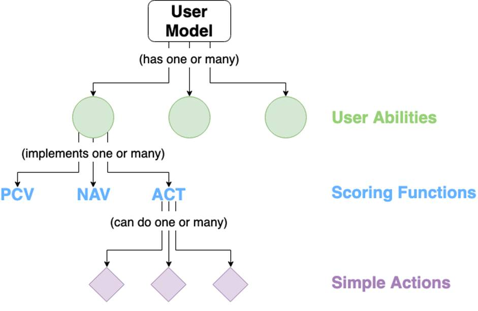
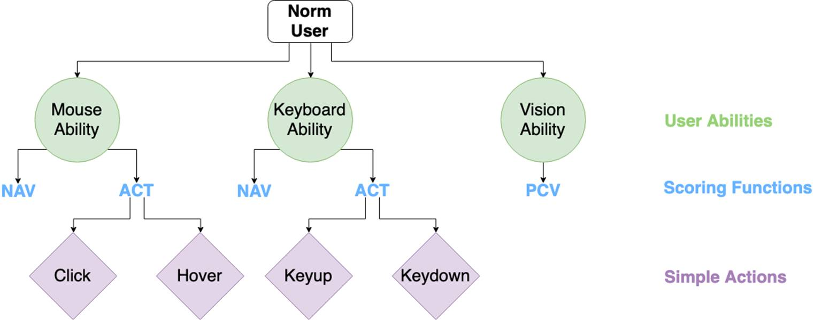
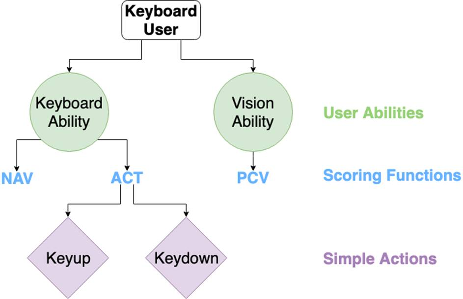

# User Models

The following three graphs explain the architecture of our `UserModel`s. A
`UserModel` is composed of `UserAbility`s. A `UserAbility` can implement
functions for perceiving an element, navigating to an element, and acting on an
element. The ACT function specifically refers to a subset of `Action`s to
describe what the `UserAbility` can do (mouse actions, keyboard actions, etc.).
These abilities combine to produce an `ability_score`, which is used to
determine the difficulty of performing an action on an element for a particular
`UserModel`.

One user might have vision, mouse, and keyboard abilities:

Another user might not have the mouse ability:

The `UserModel` looks through all its abilities when perceiving, navigating to,
or acting on an element to determine whether it can do so (and if so, how hard
it would be). If the `UserModel` is not building the graph (usually reserved for
the `OmniUser` to do), then it filters data from the already-build graph to make
these determinations. 
