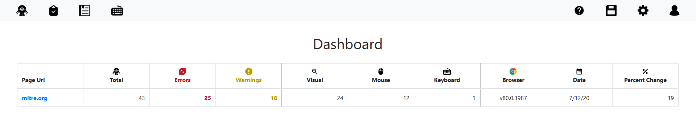
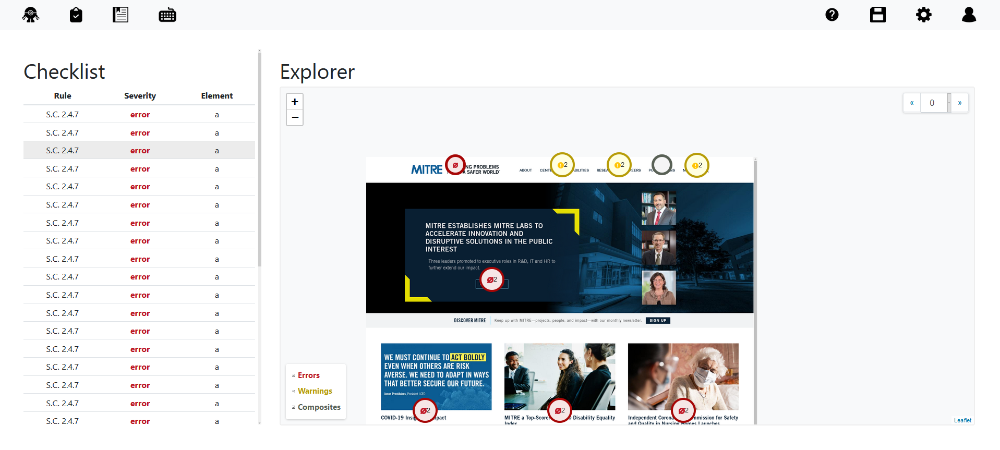

# demodocus-webapp

Web application front end to visualize results from the demodocus framework.

## Background

This prototype informs development of a web UI for Demodocus, a two-year research project focused
on automating accessibility testing web sites. Demodocus crawls web pages and
generates graphs of their dynamic state spaces, showing all the different ways a
page can be navigated by users interacting with page elements, and all the
barriers that may arise for users with different combinations of abilities.

To guide testers through results from Demodocus crawls, we need to highlight the
barriers that arose during crawling for different categories of page elements,
and to show testers where and when these barriers occurred on each page state.
This demo uses the crawl state screenshots and additional information generated
by Demodocus to render a visual map of the page elements that caused issues.

## Setup

### Node Dependencies

The front end was developed using NodeJS 12.16.3. Once node is installed, you should be able to install all of the dependencies by running:

```bash
% npm install
```

### Docker

A Dockerfile has also been provided for ease of distribution. You can build the image by running:
```bash 
$ docker build -t dem_webapp . # Build image
$ docker run -it -p 8080:8080 --rm --name dem_webapp-1 dem_webapp # Run image
```

## Development

The layout and development for this app have largely been informed by the slices available in the `slices` directory. The slices are included to shape future development and show what additional work on the web app may look like.

In general, the app provides functionality for summarizing all crawls and then inspecting specific crawls. It does not currently provide the functionality to launch the demodocus web crawler from the application itself. The two screens the web app currently provides are a dashboard overview which allows users to see high level information of all of the crawls at a glance and an inspection view which lets users dig into more details. 

### Dashboard View



The dashboard is a simple data table that shows recorded crawls, the number of violations, the users impacted, and then potentially some meta information about the crawl (this is currently fake).

### Inspection View



By clicking on a particular crawl, you can reach the inspection pane. On the left you can see a table showing all of the issues found on a particular state of the page. This is meant to work in tandem with the issue explorer pane on the right. The issue explorer displays a screenshot of the crawled page with markers hovering over places where accessibility issues exist. We do this by rendering the screenshot as a leaflet layer and then placing the markers at the element positions. 

## Running the example

Three steps are required:

* Creating crawl data using the demodocus framework
* Start the vue.js server
* Visit the example page

### Creating crawl data

Before you can use the web app, you will need to create some crawl data for it to operate on. Please see the demodocus framework instructions on crawling a url. Once you have crawled a web page, you can copy the crawl directory into the `public/crawls` directory. When the web app is built (during the next step) this directory will be automatically found and displayed for use in the web app. 

### Start a web server

In the home directory, start the vuejs web server:

```bash
% npm run serve
```

Note the URL/port the server binds to and use those in the next step.

### Visit the example

In your web browser, visit `http://localhost:8080/` (substituting
host/port name as needed). The example should load up. The bootstrap, vue,
leaflet, and axios javascript/css libraries should load from CDN.

Click on one of the issues in the table to find the issue on the screenshot. Similarly, click on an issue on the map to see it in the table.

At any time, you can change the state using the pagination in the top right. You can also select which options you would like to view (errors, warnings, or composites) with the checkboxes at the bottom left.

## Future Work

The goal of this prototype was to show how the complex data from the demodocus framework could be visualized in a way that is intuitive for testers and developers. That is, the stateful data can be understood without understanding how the algorithm behind the scenes is calculating the results. As this is only a prototype, there is still much functionality that could be introduced such as launching crawls or integrating with a database. 

The `workflow` directory contains a power point with what we believe a full user workflow would look like. While the end implementation may not be exact, we hope that this will be able to stimulate future development and serve as a guide for anyone interested.

## Accessibility of Web App

Ashamedly, as this was not the focus of our research, the web app we have built is not fully accessible. Generally, the simpler parts of the web app (namely tables and navigation) are accessible. 

Most of the accessibility issues that currently exist are within the leaflet screenshot visualization. Below are a list of known issues and some possible fixes:

1. Marker cluster not expanding on keypress - This is an issue with the underlying marker cluster code. There is currently a [Merge Request](https://github.com/Leaflet/Leaflet.markercluster/pull/1005) to fix this issue.

2. Focus Border Visible - The markers can receive focus, but have thus far defied attempts to show a visible border when focused.

3. Tab ordering - This is a tricky one. The markers are currently sorted by type and not position. Additionally, clusters seem to be placed at the bottom of the tab order when they are created, regardless of where they appear on the viz. These factors mean tab focus is constantly jumping all over the viz, not in a logical top-left to bottom-right order. 

Beyond this, additional work on usability should be considered. There are currently no great shortcut methods to quickly get between issues or jump through the found issues, thus forcing users to manually go through all of them. Additional features that can shorten this traversal would be welcome. 


## License

Software License Agreement (Apache 2.0)

Copyright (c) 2020, The MITRE Corporation.
All rights reserved.

Licensed under the Apache License, Version 2.0 (the "License");
you may not use this file except in compliance with the License.
You may obtain a copy of the License at

https://www.apache.org/licenses/LICENSE-2.0

Unless required by applicable law or agreed to in writing, software
distributed under the License is distributed on an "AS IS" BASIS,
WITHOUT WARRANTIES OR CONDITIONS OF ANY KIND, either express or implied.
See the License for the specific language governing permissions and
limitations under the License.

If this code is used in a deployment or embedded within another project,
it is requested that you send an email to opensource@mitre.org in order to
let us know where this software is being used.

